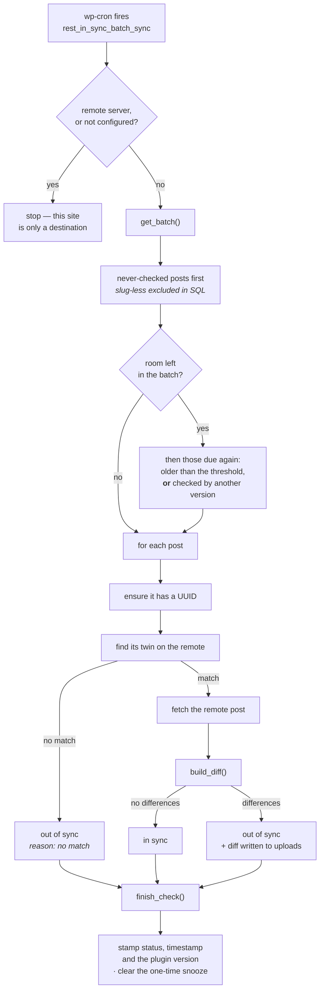
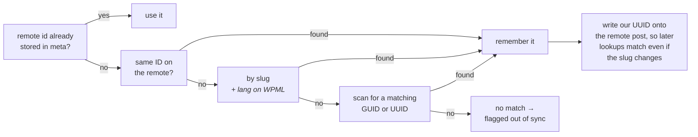
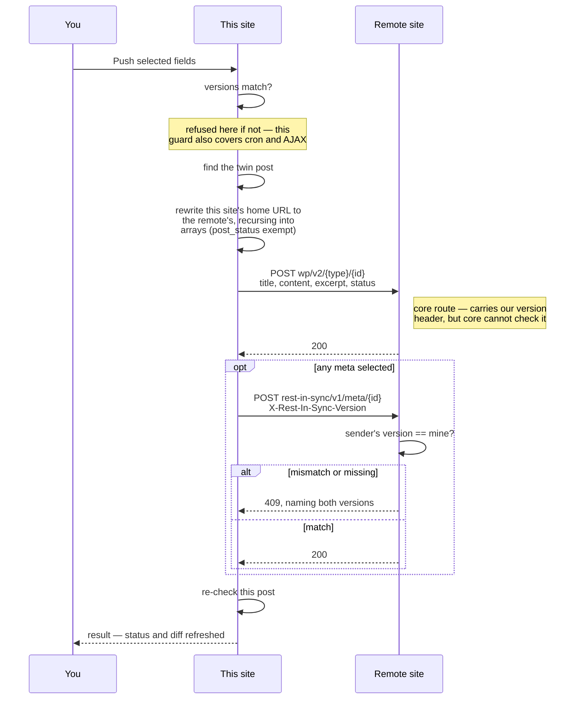

# REST in Sync

A lightweight WordPress plugin to smoothly sync posts from local environments to live servers via the WordPress REST API.

## Admin menu

The plugin registers a top-level **REST in Sync** menu with the following pages:

| Page | Description |
| --- | --- |
| Sync | Lists posts flagged out of sync by the cron job, with a search box to filter the list by title, and "Details", "Check Now", and "Ignore Until Next Sync" buttons per row. |
| Help | Explains how to set up the connection to a live site (including remote-side requirements), the cron sync check, and logging. |
| Logs | Shows daily log files of sync and connection test activity, with a file selector and a "Clear all logs" button. |
| Field Settings | Lists every field/meta key currently flagged "Don't sync by default" or "Don't use in diff" in one place, with the same toggle buttons as the Details page, plus wildcard pattern rules for excluding a whole family of meta keys at once. |
| Settings | Configures the remote site connection, which post types to sync, the cron schedule, and logging, with a "Test Connection" button. The fields are declared in `config/settings.json` and rendered by Carbon Fields through the shared [wp-plugin-packages](https://github.com/lauzis/wp-plugin-packages) settings component. |

## Two-way installs and the "remote server" setting

Since REST in Sync's own REST routes (the UUID-linking meta and the all-meta route below) are served by whichever site runs this plugin, the usual setup is to install it on **both** sites in a sync pair. The Settings page's **"This is the remote server"** checkbox marks a site as the pair's live/target side only:

- Its own sync cron job never gets scheduled (`Rest_In_Sync_Cron::maybe_reschedule()` clears any existing scheduled event instead).
- Its Sync/Details pages' manual actions (Check Now, Resync Now, Push to Remote, Pull from Remote) are disabled with a clear message, and the Sync page shows an explanatory notice instead of an out-of-sync list.
- Its `/wp-json/rest-in-sync/v1/meta/{id}` route (see "Sync Details page" below, which covers what this route is for) keeps working regardless — that's what makes it useful as a remote target in the first place.

Leave it unchecked on the site that's actually driving the sync (the one with Site URL/Username/Application Password filled in and cron enabled). Checking it hides every other Settings field (connection details, logging, post types, cron) via Carbon Fields conditional logic, since none of them apply to a pure remote target, and shows a short note explaining why.

## Connecting to a live site

The Settings page collects the live site's URL, a WordPress username, and an [Application Password](https://make.wordpress.org/core/2020/11/05/application-passwords-integration-guide/) for that user. Requests to the remote site are authenticated with HTTP Basic Auth using those credentials.

The **Test Connection** button calls the remote site's REST API for each selected post type's REST base route (e.g. `/wp-json/wp/v2/posts`, `/wp-json/wp/v2/pages`) and displays the 10 most recently updated items, or an error if the site is unreachable or the credentials are invalid. The result is also surfaced as a toast notification.

### Remote site requirements

For the connection to work, the remote (live) site needs:

- The WordPress REST API enabled and reachable — some security plugins or server configs block `wp-json` routes for external requests.
- An Application Password for the user entered in Settings, created under Users → Profile → Application Passwords on the remote site.
- That user must have sufficient capabilities to read and edit the post types being synced.
- Each post type selected in **Post Types to Sync** must be registered with `show_in_rest` on the remote site too, using the same REST base.

## Post types to sync

The **Post Types to Sync** field on the Settings page lists every *public* post type registered on this site that supports the REST API, so you can choose which ones get checked and validated. `show_in_rest` alone would also list internal block-editor/FSE post types (`wp_block`, `wp_template`, `wp_navigation`, etc.) that are registered `public => false` and aren't content anyone would sync as an article — `public => true` excludes those. Posts and Pages are checked by default.

## Sync status cron job

The Site URL, Username, and Application Password on the Settings page must all be filled in before any of this runs — the cron job, "Check Now"/"Resync Now", the Sync Details comparison, and "Push to Remote" all no-op (returning a clear "not configured" message for the manual actions) until the connection is fully configured, rather than attempting requests against a blank or partial URL.

A WP-Cron job periodically compares each syncable post against its counterpart on the remote site and records whether it's in sync. A post is matched to a remote post by trying the local post's own ID directly first, then falling back to slug, then a scan for a matching GUID or UUID. ID is tried first because slug alone can't be trusted — WPML, for example, can give multiple language translations of the same article the identical slug, distinguished only by a URL language prefix rather than the slug itself, so a slug-only lookup can resolve to the wrong translation. When this site shares history with the remote (e.g. a local dev environment cloned from the live database), the bulk of existing content shares identical post IDs, so trying that first sidesteps the ambiguity entirely; if no post exists at that ID on the remote, it's treated as genuinely new content and falls through to slug/GUID/UUID matching instead. The first time a match is found (by any method), the post's UUID is written back onto the matched remote post's `_rest_in_sync_uuid` meta over REST, so future lookups can match by that shared UUID even if the local slug later changes.

Writing that meta back to the remote post requires the remote site to accept it — which it will automatically if it's also running REST in Sync (any version with this UUID-linking feature registers the meta for REST access). Against a plain WordPress install without this plugin, the write is silently rejected as read-only protected meta, and matching just falls back to slug/GUID as before; the rest of the sync (comparisons, pushes) is unaffected either way.

### WPML sites

When WPML is active on this site (`ICL_SITEPRESS_VERSION` defined), each post's WPML language code is looked up via the `wpml_element_language_code` filter and sent as a `lang` query argument on every remote lookup request (slug search and the GUID/UUID scan). This matters because WPML's own REST API integration scopes collection queries to the site's default language unless told otherwise — without the `lang` argument, any post in a non-default language is invisible to those lookups on the remote site even though it exists there, and shows up as "No matching post was found on the remote site." On non-WPML sites, or for content WPML doesn't track a language for, no `lang` argument is sent and lookups behave exactly as before.

The comparison covers `post_title`, `post_content`, `post_excerpt`, `post_status`, and any post meta the remote site exposes via REST — excluding this plugin's own bookkeeping meta, so tracking the sync status itself can't cause a false "out of sync" result. Before comparing, every field/meta value has both sites' home URLs (any scheme, with or without "www.") replaced with a shared placeholder, so internal links, embedded image URLs, etc. — which always differ between the two domains — don't themselves cause a false "out of sync" result; JSON's optional `\/` slash-escaping is then normalized to a plain `/` (WordPress/block-editor versions disagree on whether to escape it inside a Gutenberg block's JSON attributes, though it decodes to the same character either way); and finally *all* whitespace is stripped entirely, not just collapsed, since a pretty-printed vs. minified JSON blob differs by single spaces around colons/commas, which collapsing repeated whitespace down to one space wouldn't catch. All three only affect the diff calculation; the Sync Details page still shows each field's real, unmodified saved value.

Each checked post gets these meta fields:

| Meta key | Description |
| --- | --- |
| `_rest_in_sync_uuid` | UUID identifying the post for sync linking. |
| `_rest_in_sync_remote_id` | The matched post's ID on the remote site. |
| `_rest_in_sync_status` | `never_synced`, `in_sync`, or `out_of_sync`. |
| `_rest_in_sync_last_checked` | Unix timestamp of the last comparison. |
| `_rest_in_sync_diff_id` | UUID of the diff JSON file, present only when out of sync. |
| `_rest_in_sync_checked_version` | Plugin version that performed the check, so an upgrade can invalidate it. |

When a post is out of sync, the differing fields are written as JSON to `wp-content/uploads/rest-in-sync-diffs/{uuid}.json`.

The uuid is stable per post: it is minted the first time a post goes out of
sync and reused by every later check, which overwrites the file with the
current diff. That is what keeps a Details link working — the link carries the
uuid, so a fresh one per check would leave every previously issued link
pointing at a file and a post-meta value that no longer exist, and the Details
page could only report the link as expired. The file and the meta pointing at
it are cleared together once the post is back in sync.

Settings → **Cached diffs** shows how many diff files are on disk and what they
weigh, and offers two buttons. **Clear unused** deletes files no post points at
any more, which are pure leftovers. **Clear all** deletes every file and the
meta that points at them, so nothing is left pointing at a file that is gone;
Details links stop working until each post is checked again, which rebuilds
them. A diff is derived data, so either button costs a re-check and never
information. The Sync page lists every out-of-sync post (ID, title, post type, last checked); a search box above the list filters it by title (via WP's standard `s` search, matched against `post_title`/`post_content`/`post_excerpt`). Each row's "Details" link opens that post's Sync Details page in a new tab, and its "Check Now" button re-runs `check_single()` for that post over AJAX — updating its row in place, or removing it from the list if it's now in sync — without waiting for the next cron run.

The Settings page configures:
- **Cron Batch Size** — how many posts are checked per cron run (default 10).
- **Sync Check Interval** — how often the cron runs, from every 5 minutes up to every 24 hours (default every 15 minutes).
- **Resync Threshold (hours)** — how long to wait before re-checking a post that's already been checked; posts that have never been checked are always processed first (default 24 hours).
- **Re-check after a plugin update** — treats every check made by an earlier version as out of date (default on). See "Version matching" above.

Posts with no slug are excluded from selection in SQL rather than filtered out afterwards. A post with no slug can never be matched to a remote post by slug, and its GUID is only a local `?p=ID` placeholder that can't match a real remote GUID either — so it would only ever be reported as a false "out of sync" with no way to resolve it. Excluding them at selection time matters: filtering them out *after* the batch was chosen let them fill the batch, consume its whole budget, then get discarded, leaving nothing stamped — so the next run picked exactly the same posts and did nothing again, indefinitely.

WP-Cron only fires on a page load, so on low-traffic sites checks can run later than scheduled. For reliable timing, set `define('DISABLE_WP_CRON', true);` in `wp-config.php` and trigger `wp-cron.php` from a real system cron job instead, e.g. `*/15 * * * * wget -q -O /dev/null "https://your-site.com/wp-cron.php?doing_wp_cron"`.

## Version matching

Pushes and pulls move field and meta values through this plugin's own REST route, so both sites have to agree on what that route accepts and returns. A remote running a different version may store fields differently, or not expose the route at all — pushing into that loses data quietly rather than failing loudly, which is the worst way for it to go wrong.

So syncing is refused unless both ends report the same plugin version. Four situations are told apart, because they need different fixes:

| Situation | What it means |
| --- | --- |
| Versions match | Syncing proceeds. |
| Versions differ | Both versions are named, so you know which side to update. |
| No version reported | The remote runs a version older than 0.4.0, or doesn't have the plugin active. |
| The remote errored, or the connection isn't configured | The underlying reason is shown as-is. |

The check runs **inside `push_to_remote()` and `pull_from_remote()`**, before any request leaves this site. That covers the AJAX handlers, the cron, and anything added later — not just the buttons. The Sync and Details pages additionally show the reason and disable the controls, so a blocked push is visible before the click rather than after it; that part is explanation, not enforcement.

### Both ends check

The sender's check only helps for a sender that *has* one — a site still on an older version pushes without asking. So the receiving site checks for itself too.

Every write this plugin sends carries an `X-Rest-In-Sync-Version` header naming the sender, and `/wp-json/rest-in-sync/v1/meta/{id}` refuses a `POST` whose header is missing or doesn't match, with **HTTP 409** and a message naming both versions. Since that route accepts arbitrary meta, accepting a write from a version that may shape it differently is exactly how one site quietly corrupts the other.

`GET` on the same route stays open regardless of version — comparing a mismatched pair is how you diagnose the mismatch in the first place, so reads must keep working when writes don't.

### How the version is read

Every REST response from a site running this plugin carries an `X-Rest-In-Sync-Version` header, and both remote helpers read it off responses they were already receiving. Ordinary sync traffic therefore keeps the reading current at no extra cost, and it reflects the exchange actually in progress rather than an earlier poll.

There is also a dedicated `GET /wp-json/rest-in-sync/v1/version` route, used when nothing has been talked to recently — a freshly loaded Sync or Settings page — and as an explicit pre-flight probe. It returns `{"version": "...", "plugin": "rest-in-sync"}`.

Both require an authenticated user (`edit_posts`), so a site's installed version is never advertised to anonymous visitors.

### Re-checking after an upgrade

Which fields get compared, and what counts as a difference, can change between releases — so a result recorded by an older version may no longer hold. Every completed check therefore records the version that made it in `_rest_in_sync_checked_version`, and a post whose recorded version differs from the running one is due again.

Version-stale posts sort ahead of merely-old ones, so an upgrade re-checks everything rather than trickling through it. Posts never checked at all still go first. This is controlled by the **Re-check after a plugin update** setting, on by default: a stale check is worse than an extra one.

## How a sync runs

Three flows, all going through the same matching and rewriting. Nothing here writes to the remote except **Push**; the cron only observes.

### The cron check



### Finding the twin post

Tried in order, stopping at the first hit. ID comes first because a slug alone can't be trusted — WPML can give several translations the same slug.



### Pushing a post

The only flow that changes the remote. Both sites check the version — the sender before sending, the receiver before accepting — so an older site that doesn't check still can't write into a newer one.



The two guards cover different things. The **sender's** check stops the whole operation before either request goes out, so a site running 0.4.0 or later never reaches a mismatched remote at all. The **receiver's** check is what protects a site from a sender too old to have the first one — and it guards the meta route, the one accepting arbitrary keys. Standard fields go through WordPress core's own route, which this plugin cannot gate, so a pre-0.4.0 sender can still write a title or content into a newer remote. Meta, where a version difference actually changes how values are shaped, is the part that is refused.

Pull is the mirror image: the same selected fields, written onto the local post with `wp_update_post()`/`update_post_meta()`, and the URL rewrite runs in the opposite direction so remote links don't leak into local content.

## Field settings

Every comparable field/meta key (the same set the cron job compares) has two global toggles, stored once per field/meta name in the `rest_in_sync_field_settings` option and applied across all post types:

- **Don't sync by default** — excludes the field from the default checkbox selection on the Sync Details page. It still shows up there; it's just unchecked unless selected manually.
- **Don't use in diff** — excludes the field from the cron job's out-of-sync comparison and from the stored diff, so a field that's expected to differ (e.g. a per-environment value) doesn't keep the post flagged out of sync. The field still appears on the Sync Details page for manual pushing.

Both toggles can be set from any post's Sync Details page, or managed all in one place on the **Field Settings** page, which lists every field/meta key with either toggle currently on.

That page also has **Pattern Rules**, stored separately in the `rest_in_sync_field_pattern_settings` option: a wildcard pattern — `*` matches any run of characters — applies the same two toggles to every field/meta key matching it, without having to flag each one individually. This is what makes a family of fields like per-day view-count trackers (`view_count`, `view_count_2026`, `view_count_2026-07-05`, …) manageable with one rule (`view_count*`) instead of one entry per key. A field's own explicit toggle always overrides a matching pattern for that one field — toggling either setting seeds the *other* setting from its current fully-resolved value (exact override or pattern match) rather than a blank default, so flipping one setting can never accidentally cancel a pattern's effect on the other.

## Sync Details page

The "Details" link on the Sync page opens a per-post Sync Details page with a live, field-by-field comparison against the remote post (including fields with equal values, hidden by default — toggle "Show fields with equal values" to reveal them). Each row has:

- A **Sync** checkbox, checked by default unless the field is set to "Don't sync by default" — with **Select All** / **Select None** / **Select Default** controls above the table.
- The two per-field toggle buttons described above.

Since the standard REST API only ever exposes/accepts meta explicitly registered with `show_in_rest` — which excludes most ACF fields and other custom fields by default — this plugin also registers its own route, `/wp-json/rest-in-sync/v1/meta/{id}` (`includes/class-rest-in-sync-rest-controller.php`), gated by the same `edit_post` capability check as the rest of the authenticated connection. A `GET` returns *every* meta key on a post directly; a `POST` writes a `{"meta": {...}}` body the same way, refusing protected (underscore-prefixed) keys so it can't be used to overwrite internal bookkeeping, and refusing writes from a mismatched plugin version (see "Version matching" above). Without this, pushing or pulling an unregistered meta key would silently have no effect at all through the standard endpoint alone — WordPress just drops it. When the remote site is also running a plugin version with this route: reads are merged in and become real, comparable data counted toward the cron's out-of-sync status; pushes/pulls of any meta key actually take effect, not just the handful that happen to be REST-registered. If the remote doesn't have the route yet (an older version, or a plain WordPress install), reads degrade gracefully to the standard REST-exposed meta only, and pushes/pulls are limited to that same handful.

Any local meta key still not covered by either source is listed in the Details view anyway, marked "not exposed on remote" with no remote value shown, since there's no way to know what the remote actually holds for it. These are always included there (not hidden behind "Show fields with equal values") but never counted toward the cron's out-of-sync status — a site can easily have hundreds of such fields (e.g. per-day view-count trackers), and there's no remote value to genuinely compare against. A **Filter by field name** box above the table helps narrow down large field/meta lists.

For the `title`, `content`, and `excerpt` fields, a differing Local/Remote pair is rendered with their differing words highlighted (`Rest_In_Sync_Diff_Renderer`, in `includes/class-rest-in-sync-diff-renderer.php`), reusing the same word-level diff engine WordPress uses for post revisions. If the two values are too dissimilar for word-level highlighting to be useful, it falls back to plain text automatically.

A **Resync Now** button next to the post title re-runs the sync check for just this post over AJAX (the same underlying action as the Sync page's "Check Now"), then reloads the page so the comparison, status, and diff link all reflect the fresh result. Below that, the page also shows this post's local/remote IDs and this post's own permalink and the matched remote post's URL side by side, so you can open both directly to compare them as a real reader would — useful for spotting things a field-by-field diff can't, like a translation that was never actually written.

Below the URLs, **Edit** and **Revisions** buttons link straight into each site's wp-admin for that post — the edit screen, and (via WordPress core's own `/revisions` REST route on the remote, the same authenticated connection as everything else) directly into the two-pane revision comparison screen for its most recent revision, or "No revisions yet" if it doesn't have one. This is the fastest way to see *when* and *by whom* a field actually changed on either site — something a REST-based diff alone can't tell you.

Next to it, **Ignore Until Next Sync** (also available per-row on the Sync page) sets a one-time `_rest_in_sync_ignored` flag that hides the post from the out-of-sync list without changing its actual status — unlike the permanent, global "Don't use in diff" field setting, this is a per-post, temporary snooze. The very next check (cron or manual) for that post clears the flag automatically regardless of outcome, so a post that's still genuinely out of sync reappears rather than staying hidden forever. From the Details page, since there's nothing else to see here once a post is ignored, a successful click redirects back to the Sync page so you can see it's actually gone from the list.

**Push to Remote** sends the checked fields (and any selected meta as a `meta` object) as an authenticated REST request to the remote post, then re-runs the sync check for that post so its status and diff reflect the new state.

**Pull from Remote** is the mirror image: it takes the same checked fields/meta but writes the remote's values onto this local post instead, via `wp_update_post()`/`update_post_meta()` — the home-URL rewrite (see below) runs in the opposite direction so remote links don't leak into local content. Both actions show a confirmation dialog before proceeding, since either one overwrites real content, and both reload the page on success so the comparison reflects the new state. The result is shown as a toast notification, consistent with Test Connection's UX.

Each row also has its own **Push**/**Pull** buttons in the Actions column, for syncing just that one field/meta key without touching anything else selected — same underlying AJAX actions as the bulk buttons (each sends a one-item `fields` array), same confirmation dialog (naming that specific field), same reload-on-success.

Before sending, every pushed field/meta value (except `post_status`) has this site's own home URL rewritten to the remote site's home URL — recursing into arrays, so structured fields like ACF values are covered too — and pulling rewrites in the opposite direction. Without this, any internal link, embedded image, or similar URL authored on one site would carry over verbatim and end up pointing at the wrong domain once on the other site. Only the site-of-origin's own URL is touched; unrelated external links are left alone.

This job only detects and records sync status — pushing content is a manual action from the Sync Details page.

## Logging

Logging comes from the shared [wp-plugin-packages](https://github.com/lauzis/wp-plugin-packages) library; `Rest_In_Sync_Logs` is a thin facade over it, so this plugin's log files and settings behave the same as the other plugins'. When "Enable logging" is checked on the Settings page, connection tests, cron sync checks, and remote post lookups are written to daily log files under `wp-content/uploads/rest-in-sync-logs/`. Errors are always written to PHP's `error_log`, and additionally to these files when logging is enabled. Remote lookups log both the attempt (slug, GUID, UUID, and detected WPML language, if any) and, on a miss, how many remote entries were actually scanned — useful for telling apart a genuinely unmatched post from one hidden by a remote-side filter (e.g. WPML's default-language scoping). The Logs page lets you pick a day's log file, view its entries, or clear all log files, confirming deletion with a toast notification.

Entries can also be posted to **Slack**: fill in an incoming webhook URL on the Logging settings and pick whether Slack gets errors only (the default) or every entry. Errors are posted even with file logging off. Sending is fire-and-forget so a sync never waits on Slack, which means a webhook Slack rejects fails quietly; only `https://` URLs are used, since the webhook URL is itself a credential. Every entry means one request per entry against a webhook Slack rate-limits to roughly a message a second — on a site where cron sync checks run every few minutes that is a lot of noise, so errors only is the setting to leave on.

## Notifications

Actions that need immediate feedback (Test Connection results, clearing logs) show a dismissible toast in the corner of the screen, in addition to the existing inline notices. The toast component comes from the shared [wp-plugin-packages](https://github.com/lauzis/wp-plugin-packages) library, so it behaves identically across these plugins. `assets/js/toast.js` remains as a thin alias, so `window.RestInSyncToast.show(message, type)` still works, where `type` is one of `success`, `error`, `warning`, or `info`.

## Development

Install PHP dependencies (Carbon Fields and the shared component library) with Composer:

```
composer install
```

Settings fields live in `config/settings.json` rather than in PHP. After changing them, regenerate the translation manifest so `wp i18n make-pot` can still see the strings:

```
vendor/lauzis/wp-plugin-packages/bin/schema-i18n \
  --domain=rest-in-sync --out=languages/schema-strings.php config/settings.json
```

## Changelog

### 0.5.1
- Added a **Send a test message** button beside the Slack webhook field. It posts to whatever is in the field, saved or not, waits for Slack's answer and reports it — log traffic is fire-and-forget, so a webhook Slack rejects otherwise fails silently.
- The Slack webhook field is hidden on a remote server, alongside the logging switch it belongs to.

### 0.5.0
- Log entries can be sent to **Slack**. A webhook URL and an errors-only/every-entry choice on the Logging settings; errors are posted even with file logging off. See [Logging](#logging).
- Bundled shared library updated to wp-plugin-packages 1.15.0.

## Requirements

- PHP 7.4+
- WordPress with the REST API enabled
- The same plugin version on both sites of a sync pair — writes between mismatched versions are refused by both ends

## License

MIT

---

> This project is maintained with the assistance of [Claude Code](https://claude.ai/code) and [CodeRabbit](https://coderabbit.ai).
